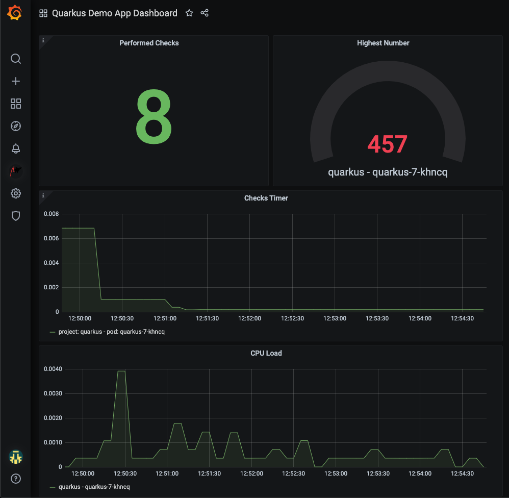

# quarkus project

This project uses Quarkus, the Supersonic Subatomic Java Framework.

If you want to learn more about Quarkus, please visit its website: https://quarkus.io/ .

## Running the application in dev mode

You can run your application in dev mode that enables live coding using:
```shell script
./mvnw compile quarkus:dev
```

## Packaging and running the application

The application can be packaged using:
```shell script
./mvnw package
```
It produces the `quarkus-1.0.0-SNAPSHOT-runner.jar` file in the `/target` directory.
Be aware that it’s not an _über-jar_ as the dependencies are copied into the `target/lib` directory.

If you want to build an _über-jar_, execute the following command:
```shell script
./mvnw package -Dquarkus.package.type=uber-jar
```

The application is now runnable using `java -jar target/quarkus-1.0.0-SNAPSHOT-runner.jar`.

## Creating a native executable

You can create a native executable using: 
```shell script
./mvnw package -Pnative
```

Or, if you don't have GraalVM installed, you can run the native executable build in a container using: 
```shell script
./mvnw package -Pnative -Dquarkus.native.container-build=true
```

You can then execute your native executable with: `./target/quarkus-1.0.0-SNAPSHOT-runner`

If you want to learn more about building native executables, please consult https://quarkus.io/guides/maven-tooling.html.

# Deploying on OCP

In order to build it in native executables and deploy it we added the openshift extension to the `pom.xml` which can also be done manually by running (it is already there so this is *only for information purpose*):

```shell
 ./mvnw quarkus:add-extension -Dextensions="openshift"
```

To actually deploy it you need to have `oc` client installed and configured, also be sure you have a project created and has your `oc` client pointing to the right project. You can execute the command below to build a native binary and deploy within the project created previously:

```shell
./mvnw clean package -Dquarkus.kubernetes.deploy=true -DskipTests -Dquarkus.kubernetes-client.trust-certs=true
```
The attribute `-Dquarkus.kubernetes-client.trust-certs=true` is only to skip the self-signed certs if you are using them.

You also has the option to import the grafana dashboard that will show some of the custom metrics exposed by the application, which can be checked by the `/metrics` endpoint.

To import the dashboard just copy the content of the `quarkus-app-grafana-dashboard.json` into Grafana when importing a dashboard, also make sure to have the Datasource created (see `rhel-edge/resources/prometheus-grafanadatasource.yaml`)

### Quarkus Metrics Grafana Dashboard
